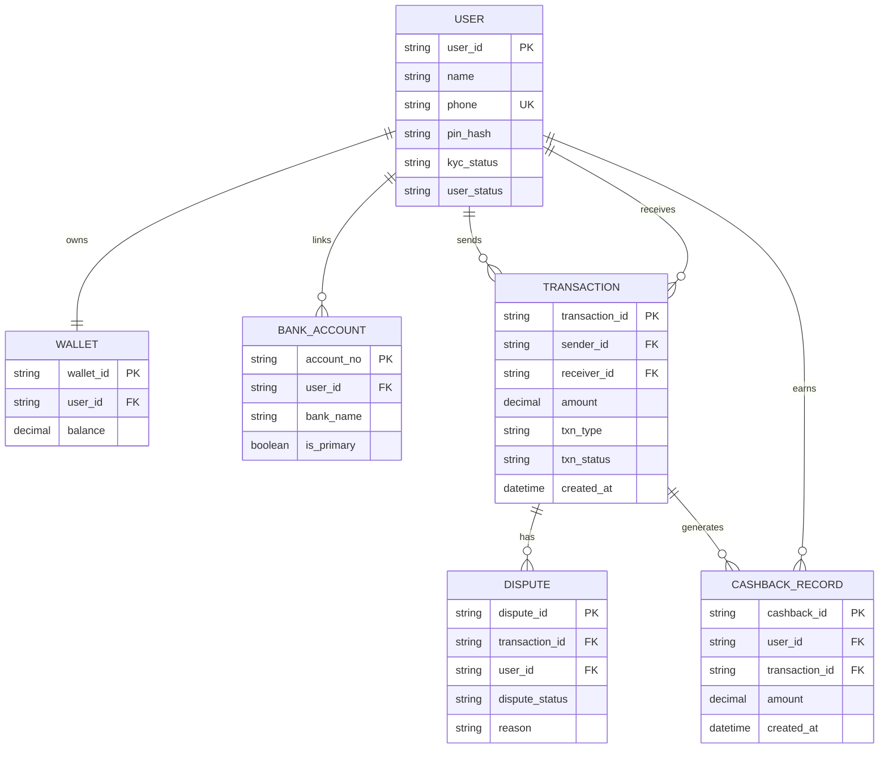

# Digital Wallet – ER Diagram

```mermaid
erDiagram
    USER ||--|| WALLET : owns
    USER ||--o{ BANK_ACCOUNT : links
    USER ||--o{ TRANSACTION : sends
    USER ||--o{ TRANSACTION : receives
    TRANSACTION ||--o{ DISPUTE : has
    USER ||--o{ CASHBACK_RECORD : earns
    TRANSACTION ||--o{ CASHBACK_RECORD : generates

    USER {
        string user_id PK
        string name
        string phone UK
        string pin_hash
        string kyc_status
        string user_status
    }
    WALLET {
        string wallet_id PK
        string user_id FK
        decimal balance
    }
    BANK_ACCOUNT {
        string account_no PK
        string user_id FK
        string bank_name
        boolean is_primary
    }
    TRANSACTION {
        string transaction_id PK
        string sender_id FK
        string receiver_id FK
        decimal amount
        string txn_type
        string txn_status
        datetime created_at
    }
    DISPUTE {
        string dispute_id PK
        string transaction_id FK
        string user_id FK
        string dispute_status
        string reason
    }
    CASHBACK_RECORD {
        string cashback_id PK
        string user_id FK
        string transaction_id FK
        decimal amount
        datetime created_at
    }
```

This is a logical ER diagram. Confirm final names and optional relationships with
the team before implementing a real SQL database.
